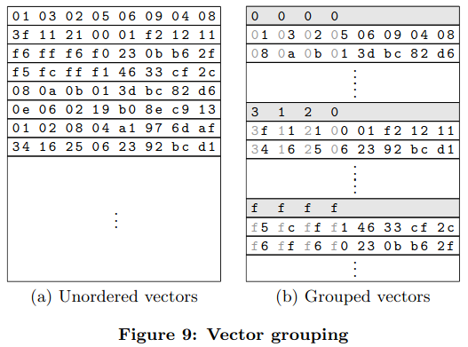
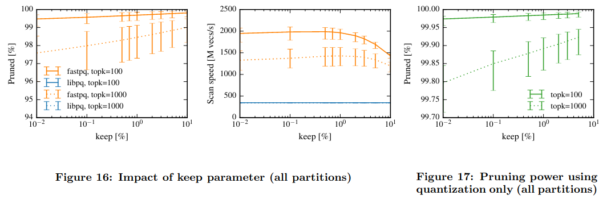

# Cache locality is not enough: High-Performance Nearest Neighbor Search with Product Quantization Fast Scan

http://www.vldb.org/pvldb/vol9/p288-andre.pdf

Product quantization [1] - техника сжатия с потерями, позволяющая снизить затраты времени и памяти при решении задачи [MIPS](https://en.wikipedia.org/wiki/Maximum_inner-product_search). 

Основная идея PQ - декомпозиция векторного пространства размерности $d$ на $m$ подпространств размерости $d / m$, и разбиение каждого из $m$ подпространств на $k$ [ячеек](https://en.wikipedia.org/wiki/Voronoi_diagram), каждой из которых присваивается код и центроида. Product quantizer: это функция $q: \R^{d} \rightarrow \{0,..,k-1\}^m$, отображающая вещественнозначный $d$-мерный вектор на кортеж из $m$ целочисленных кодов центроид. Пусть $D$ - центроиды размерности $[k, d]$: $D[i, d//m * j:d//m * (j + 1)]$ - $i$-ая цетроида $j$-ого subquantizer-а. Тогда код инференса в режиме ADC следующий:

```python
import numpy as np

# q: [d], float
# centroids: [m, k, d//m], float
# data: [n, m], int

Dc = compute_dists(centroids, q)  # [m, k]
dists = np.zeros(n)
for i in range(n):
    xc = data[i]
    for j in range(m):
        dists[i] += Dc[j, xc[j]]
```

Данный алгоритм работает за $\mathcal{O}(nm)$, что в $d/m$ раз быстрее, чем $\mathcal{O}(nd)$. При использовании IVFADC время снижается ещё в $\frac{K}{nprobe}$ раз, где $K$ - число кластеров в coarse quantizer-е, $nprobe$ - число кластеров, над векторами которых происходит полный перебор.

Данная статья посвящена ускорению этого алгоритмы. Показано, что в текущем виде алгоритм не полностью использует возможности процессора. Предлагается такая реализация алгоритма, которая позволяет задействовать [SIMD](https://en.wikipedia.org/wiki/Single_instruction,_multiple_data) инструкции. Утверждается, что PQ Fast Scan в 4-6 раз быстрее, чем PQ Scan. Под cache locality в названии имеется ввиду аллокация таблицы расстояний в L1 кэше процессора. Также утверждается, что PQ scan в дефолтной реализации не может быть ускорен с использованием SIMD инструкций. Основная идея PQ Fast Scan - сжатие lookup таблиц таким образом, чтобы они могли помещаться в SIMD регистры, чтоб можно было использовать SIMD инструкции для взятие элементов оттуда и расчёта расстояний. В исходном виде эти таблицы в регистрах аллоцировать не удастся из-за большого их размера. Используются следуюшие техники уменьшения таблиц:
* grouping of similar vectors
* computation of minimum tables
* квантизация расстояний из fp32 в int8

Каждый из этих приёмов будет описан ниже.

## **PQ Scan limitations**

В этом разделе рассматриваются два ключевых bottleneck-а PQ Scan:
1. Много запросов к кэшу.
2. Невозможность эффективно использовать SIMD инструкции.

### **Many cache accesses**

Для расчёта расстояния между веткором запроса и вектором базы в PQ Scan требуются следующие действия:
1. $m$ запросов для получения индексов центроидов $i$
2. $m$ запросов в таблицы расстояний $D_j[i]$
3. $m$ сложений элементов, полученных на предыдущем шаге.

Запросы из первого шага всегда успешно выполняются с использованием L1 кэша благодаря префетчерам ([cache hit](https://en.wikipedia.org/wiki/CPU_cache#Cache_entries)), которые заранее подгружают необходимые данные в L1 кэш.
Запросы из второго шага могут выполняться с разной-скоростью в зависиомти от размера таблиц расстояний, а именно от параметров $m$ и $k$: размер таблиц равен $32mk$ бит в случае, если расстояния хранятся в float32. В таблице ниже показаны размеры разных уровней кэшей и приемлемые для каждого уровня конфигурации $m$ и $k$:


* для обеспечения максимально быстрого доступа к таблицам нужно, чтоб они были в L1 кэше: т.е. $m$ должно быть 16 или 8.

Конфигурация $m = 8$, $k = 2^8 = 256$ является наиболее оптимальной по соотношению размер/время (соответствующий анализ бы проведен в [1]), поэтому далее будет использована эта конфигурация

### **Inability to leverage SIMD instructions**

После получения необходимых элементов их нужно сложить. И тут можно использовать SIMD инструкции, которые бы выполняли это действие сразу на нескольких векторах. Если рассмотреть AVX SIMD инструкции, то для их реализации требуются 256-битные регистры. Это позволяет подгружать в них 8 $m$-мерных векторов с расстояниями в float32: с помощью инструкции `gather`:


... и выполнять сложение следующим образом:


Проблема в том, что, оказывается, это ещё медленней, чем наивная реализация:


Объясняется это деталями реализации `gather`: она требует много μops (микро-операций): см. таблицу 2 ниже. В статье приводятся рекомендации Intel: "`gather` instructions may only bring performance benefits in specific cases"

## **PQ Fast Scan**

Нотация и значения некоторых гиперпараметров:
* $m = 8$
* $k = 256$
* $D_j$ - одна из $m$ строк таблицы расстояний для ADC (см. код выше). Это $k$-мерный вектор, элементы коротого - float32
* $l$ - число компонент, на которое разбивается $D_j$. $l = 16$
* $S_j$ - уменьшенная версия $D_j$. Это $l$-мерный вектор, элементы которого - int8.

Ключевые идеи fast scan:
* $D_j$ в L1-кэше $\rightarrow$ $S_j$ в SIMD регистрах. 1) меньше запросов к L1-кэшу, 2) использование SIMD-инструкций в том числе для суммирования скаляров.
* $S_j$ используются для подсчёта нижних границ расстояний между запросом $q$ и хранимым вектором  $p$. Идея в том, что такая штука позволяет сильно снизить количество расчётов точных расстояний (в статье говортся, что примерно на 95%), для расчёта которых требуется лезть в L1-кэш. Зачение от меня: если требуется искать искать $x$, максимизирующий $q \cdot p$, то задача разворачивается в сторону максимизации.

Ниже представлена схема алгоритма:


Символом $\otimes$ обозначен пропуск вектора, который далее будем называть прунингом (от pruning).

Детали:

Каждая $S_j$ располагается в отдельном SIMD-регистре. 

Так как $S_j$ располагаются в SIMD регистрах, 
1) для взятия элементов из них используется инструкция `pshufb`, в отличие от `gather`, которая используется для взятия элементов из таблиц в L1-кэше:

2) размер таблиц должен быть 128 бит (в случае SSE SIMD инструкций). В данном случае это достигается тем, что $l = 16$ и типом int8.

Не все $S_j$ строятся одинаково. Первые четыре таблицы строятся с использованием техники *vector grouping*, вторые - *minimum tables*.

### **Vector grouping**

Основная идея - сгруппировать векторы базы таким образом, чтобы каждая из групп триггерила запросы к одному и тому же небольшому куску векторов $D_j, 0 < j < 4$. В таком случае эти небольшие куски можно будет подгрузить в SIMD регистры один раз, и использовать их для целой группы.

Так как $k = 256$, каждый код удобно представлять как пару чисел в шестнадцатиричной системе: каждое принимает значения 0-9a-f.

Разобьём каждую из $D_j$ таблиц на 16 частей по 16 элементов, $0 <= j < 4$. Пусть в первой части лежат расстояния до центроидов, номер которых начинается на 0, во второй - на 1, ..., в 16-ой - на f. Тогда, по коду $(i_0, i_1, i_2, i_3)$ можно сгруппировать хранимые векторы, и для расчёта расстояний между запросом и каждым вектором такой группы в регистры достаточно подгрузить только слайсы $D_j[16i_j:16(i_j + 1)]$, где $i_j$ - шестнадцатиричный код. Для того, чтобы слайсы поместились в регистры их элементы необходимо квантизировать до 8 бит, о чём будет сказано ниже. При использовании квантизации размер каждого слайса будет как раз $16 * 8 = 128$ бит. На рисунке ниже показано, как осуществляется группировка:



Размер кода $c$ - гиперпараметр, который подбирается исходя из размера датасета $n$. Средний размер группы $s = \frac{n}{16^c}$. Для лучшей производительности рекоммендуется, чтобы $s > 50$. В противном случае основная часть работы цпу будет уходить на подгрузку слайсов $D_j$ в регистры. В разделе evaluation будет показано, как именно $s$ влияет на пропускную способность.

Учитывая, что данный алгоритм целесообразно гонять на огромных датасетах, предполагается, что минимальный размер группы $n_\text{min} = 50 * 16^c$ примерно равен 3.2M и экспоненциально растёт по $c$. Поэтому в дальнейших экспериментах всегда используется $c = 4$.

Также отмечается, что грппировка векторов позводяет снизить затраты памяти на хранения векторов на 25% при $m=8$: на рис. 9 серым отмечены значения, которые хранить не обязательно.

### **Minimum tables**

Здесь всё интуитивно проще и может быть понятно по одному рисунку:


Как и в предыдущем пункте, в результате такой операции получаются $S_j$ размерности 16 с элементми float32, которые потом квантизируются до int8, чтоб помещаться в регистры.

При применении такого подхода в лоб есть проблема: в minimum tables расстояния будут мало отличаться друг от друга. Действительно, минимум берется по расстояниям от запроса до 16 случайных центроид, и если центроиды распределены равномерно, то матожидание минимумов не будет меняться от блока к блоку. Решение - *optimized assignment* - присваивать идентификаторы в соответствии со взаимным расположением центроидов и числом блоков. Идея наглядно иллюстрируется на рисунке:


Для такого assignment-а учится ещё один k-means над 256 центроидами на 16 кластеров.

### **Quantization of distances**

На данный момент мы имеем 8 таблиц $S_j$ по 16 элементов float32. Пока они не помещаются в регистры. Для того, чтобы поместились, их элементы нужно сжать до 8 бит. Так как нет SIMD инструкций для сравнения uint8, значения сжимаются до int8, при этом используется только диапозон 0-127. Сжатие происходит путём бинаризации расстояний на 128 бинов: 127 бинов для значений между $q_\text{min}$ и $q_\text{max}$, и 1 бин для значений выше $q_\text{max}$. $q_\text{min}$ - минимальное расстояние среди всех $D_j$, $q_\text{max}$ - минимальное расстояние между запросом и первыми $\%keep$ векторами базы (в статье берется $keep = 1$). Это делается для снижения ошибки квантизации - идея в том, чтобы максимальным числом бинов покрыть наиболее репрезентативный интервал расстояний:


Для устранения overflow используются *saturated SIMD additions*.

### **Looking up small tables**
Ниже схематично представлено, как именно используются $S_j$ для подсчёта нижних границ расстояний:


Таким образом, итоговый алгоритм подсчёта нижних границ расстояний следующий:
1. Подгрузить таблицы $S_j$ в регистры, $4 <= j < 8$; $min = +\infty$
2. Для всех комбинаций кодов $(i_0, i_1, i_2, i_3)$:  
    2.1. Подгрузить таблицы $S_j$ в регистры $0 <= j < 4$ ($S_j$ - квантизированный слайс $D_j$, зависящий от $i_j$)  
    2.2. Подгрузить группу векторов, соответствующих коду $(i_0, i_1, i_2, i_3)$: т.е. такие векторы $p$, что $p[j][0] = i_j, 0 <= j < 4$  
    2.3. Для каждого вектора группы $p$:  
        2.3.1. $lower\_bound = \sum_{j=0}^{3} S_j[p[j][1]] + \sum_{j=4}^{7}S_j[p[j][0]]$  
        2.3.2. Если $lower\_bound < min$, то $min = lower\_bount$, считать более точное расстояние с использованием $D_j$ из L1-кэша, иначе - переход к следующей итерации.

Для взятия элементов $S_j$ при суммировании во внутреннем цикле используется инструкция `pshufb`.

Рассуждения от меня на тему квантизации нижней границы расстояний:

Пусть $f(x) = bin(x)$ - функция квантизации, используемая для получения $S_j$. Далее, пусть $lb_q(p)$ - функция получения $lower\_bound$ из п.2.3.1., $lb(p)$ - та же функция, только используются таблицы $D_j$. Вообще говоря, неверно, что $lb_q(p_0) < lb_q(p_1) \Rightarrow lb(p_0) < lb(p_1)$.

Это можно показать на примере: пусть $p_0$ и $p_1$ таковы, что:
* $D_j[p_0[j]] = D_j[p_1[j]], S_j[p_0[j][1]] = S_j[p_1[j][1]] = 0, 0 \le j < 4$

* $S_j[p_0[j][0]] = 0, 4 \le j < 8, D_j[p_0[j]] = q_\text{min} + b - \epsilon$, где $b$ - размер бина, $\epsilon$ - небольшое положительное число.

*  $S_j[p_1[j][0]] = 0, D_j[p_1[j]] = q_\text{min}, 4 \le l < 7, S_7[p_1[7][0]] = 1, D_7[p_1[7]] = q_\text{min} + b + \epsilon$.

Тогда:
* $lb_q(p_0) = 0; lb(p_0) = 4(b - \epsilon) + C, C = \sum_{j=0}^{3} D_j[p[j]]$
* $lb_q(p_1) = 1; lb(p_1) = 3q_\text{min} + b + \epsilon + C$

Неравенство $lb(p_0) > lb(p_1)$ выполняется при $b > q_\text{min} + \frac{5}{3}\epsilon$.

Ниже показана визуализация данного примера:


Судя по тому, что в статье утверждается, что результаты работы PQ Fast Scan в точности совпадают в экспериментах с PQ Scan, такая ситуация выглядит маловероятной: когда $lb_q(p_0) < lb_q(p_1) \land lb(p_0) > lb(p_1)$.

## Evaluation

Качество оценивалось на датасете [ANN_SIFT1B](http://corpus-texmex.irisa.fr/). Векторы размерности 128. 
Датасет состоит из трёх частей: обучение - 100M, база - 1B, запросы - 10k
Обучающая выборка была уменьшена со 100M до 10M. 
Для экспериментов было использовано два подмножества ANN_SIFT1B:
* ANN_SIFT100M1 - подмножество базы из 100M векторов, разбитое на 8 частей (IVF):

* ANN_SIFT1B - полная база для large scale экспериментов.

Тестировалось влияние следующих параметров на производительность:
* *keep* - от него зависит качество квантизации $D_j \rightarrow S_j$, определяемое параметром $q_\text{max}$ и степень прунинга.
* *topk* - число возвращаемых ближайших соседей. От него также зависит степень прунинга.
* *partition size* - для скольки векторов нужно считать расстояния.

Утверждается, что результаты в точности совпадают с libpq.

Далее будут сравниваться следующие реализации:
* [libpq](http://people.rennes.inria.fr/Herve.Jegou/projects/ann.html) - PQ Scan
* [fastpq](https://github.com/technicolor-research/pq-fast-scan) - PQ Fast Scan

Все эксперименты проводились на одном ядре цпу.


* fastpq стабильно превосходит по скорости libpq в 4-6 раз

### **Impact of keep and topk parameters**

Как было отмечено выше, на производительность данные параметры оказывают следующее влияние: 
* больше *keep* $\rightarrow$ меньше $q_\text{max}$ $\rightarrow$ больше размер 127-ого бина $\rightarrow$ больше расстояний попадают в этот бин $\rightarrow$ сильней прунинг
* больше *topk* $\rightarrow$ больше $min$ (см. алгоритм подсчёта нижних границ расстояний) $\rightarrow$ слабей прунинг  

На рисунке 16 показана зависимость прунинга и скорости от *keep*, а на рисунке 17 - зависимость прунинга от *keep* в сетапе, когда используется только квантизация: т.е. $S_j$ - 256-мерный вектор из int8. В этом случае $S_j$ нельзя поместить в регистры, поэтому время не показана зависимость времени от *keep*



* при $topk = 100$ прунинг сильнее и менее чувствителен к $keep$, чем при $topk = 1000$.
* скорость поиска немного растёт по $keep$, потому что увеличивается прунинг, как было сказано выше. Но после какого-то порога скорость начинает падать, потому что слишком много времени тратится на получение $q_\text{max}$ - ведь для этого нужно пройтись медленным libpq по первым $n * keep$ векторам.
* одна квантизация позволяет достичь очень выского прунинга: 99.9-99.97% против 98-99.7% в оригинальном fastpq

Ниже показаны те же зависимости от *topk*:


* как и было скзаано ранее, чем больше *topk*, тем ниже прунинг $\rightarrow$ ниже скорость.
* libpq не зависит от *topk*, но даже при $topk = 10^3$ fastpq существенно выигрывает по скорости у libpq.
* чем больше *topk*, тем выше дисперсия прунинга $\rightarrow$ выше дисперсия скорости

### **Impact of partition size**

Ниже показаны те же зависимости от числа векторов:


* прунинг почти не зависит от размера блока
* скорость почти не зависит от размера блока, если он большой. В случае маленьких блоков пропусная способность проседает: слишком много цпу времени тратится на подгрузку таблиц в регистры, как было сказано ранее. В таком случае рекоммендуется группировать не по первым 4 элементам $p$, а по первым трём ($c = 3$).

### **Large scale experiment**

* база поиска - 1B векторов
* IVF128, каждый кластер примерно по 8M векторов
* 10k запросов
* *keep = 1%*
* *topk = 100*

Эксперимент проводился на следующих платформах:


Результаты:


* fastpq стабильно превосходит libpq по скорости
* fastpq выигрывает также по памяти, необходимой для хранения векторов. Этот выигрыш достигается за счёт того, что код группы не нужно хранить для каждого вектора (см. раздел vector grouping).
* fastpq лучше утилизирует цпу ресурсы, чем libpq: столбец A графика Scan speed, соответствующий наиболее новому из сравниваемых цпу. 

### **Conclusion**

PQ Fast Scan - значительно более быстрая альтернатива классическому PQ Scan. Ключевые идеи, позволяющие достичь такого ускорения:
* размещение таблиц расстояний в SIMD регистрах: а именно, придумано, как это можно реализовать в учётом того, что в исходном виде эти таблицы туда не помещаются;
* использование L1 кэша только для расчёта расстояний между запросом и небольшим подмножеством хранимых векторов.

### **References**

[1]  [H. J ́egou, M. Douze, C. Schmid. Product quantization for nearest neighbor search, 2011](https://lear.inrialpes.fr/pubs/2011/JDS11/jegou_searching_with_quantization.pdf)