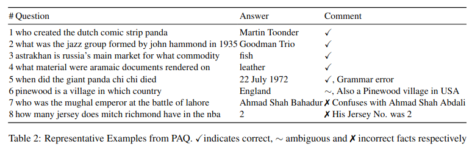

# PAQ: 65 Million Probably-Asked Questions and What You Can Do With Them

https://arxiv.org/abs/2102.07033

### **Abstract**

Рассматривается задача CBQA (closed book question answering) - требуется ответить на вопрос без доступа к документной базе знаний (например, к википедии). Замечено, что текущие на момент написания статьи датасеты с парами (вопрос, ответ) покрывают не особо много тем. В статье предлагается следующее:
*  *Probably asked questions* (PAQ) - синтетический датасет из 65M пар (вопрос, ответ);
* *RePAQ* - ретривер по PAQ.
Идея в том, что такая штука значительно быстрее, чем связка retriever + reader. А огромная вопросно-ответная база позволяет обеспечить высокую полноту поиска.

### **Introduction**

Выделим основные типы вопросно-ответных систем:

| approach          | search base   | pros                                     | cons     |
|-------------------|---------------|------------------------------------------|----------|
| open-book         | any documents | largest possible coverage, best accuracy | speed    |
| closed-book       | -             | single model, least memory               | accuracy |
| QA-pair retriever | QA-pairs      | single model, best speed                 | coverage |

Ниже кратко показано, как работает каждая из этих систем:

* *open-book*: запрос $\rightarrow$ *retriever* $\rightarrow$ множество контекстов $\rightarrow$ *reader* $\rightarrow$ ответ
* *closed-book*: запрос $\rightarrow$ *seq2seq* $\rightarrow$ ответ
* *QA-pair retriever*: запрос $\rightarrow$ *retriever* $\rightarrow$ ответ

В данной статье проверяется, способен ли *QA-pair retriever* догнать подход *open-book* по качеству, если сильно увеличить базу поиска.

### **Generating QA pairs**

Компоненты пайплайна по созданию PAQ:

1. **passage selection** - поиск информативных контекстов: таких, которые бы содержали ответ на какой-нибудь реальный пользовательский запрос. Для этого фитится распределение $p_s(c)$: модель учится искать положительный конеткст среди $k$ кандидатов (по аналогии с ридером из [1]). Положительный контекст - такой контекст из NQ, для которого есть пара (вопрос, ответ). Для каждого контекста ищутся сложные и простые отрицательные. Сложные отрицательные - контексты из той же статьи, что положительный контекст. Простые отрицательные - случайные контексты. В качестве энкодера контекстов взята roberta-base [9]. С помощью такой модели отбираются топ-$N$ контекстов википедии.

2. **answer extraction** - поиск спанов, которые могут быть ответами на какие-то вопросы. 
Для этого фитится распределение $p_q(a | c ) = p([start, end] | c), end - start \le 30$, где $[start, end]$ - конкатенация векторов, соответствующих первому и последнему векторам спана. На инференсе выбираются топ-$k$ наиболее вероятных спана. Такой подход применим и к ситуациям, когда в контексте есть нексколько спанов ответов. Брать только именные сущности в качестве кандидатов на ответ не очень, потому что они будут покрывать ответы далеко не на все вопросы.

3. **question generation** - генерация вопроса на основе контекста из шага 1 и спана ответа из шага 2. Для этого фитится распределение $p(q | a,c)$. Ответ $a$ оборачивается в контексте $c$ в специальные токены.

4. **filtering** - фильтрация сгенерированных на шаге 3 вопросов: вопрос должен быть удален, если он 1) не согласован с контекстом и ответом, 2) является двусмысленными: т.е. на него можно ответить *только* при наличии конекста, на основании которого он сгенерирован. Для этого фитится распределение $p_f(a | q, C)$, где $C$ - топ-50 контекстов, релевантных $q$, причём среди них не должно быть того, на основании которого был сгенерирован $q$. В качестве модели используется FiD-base из [3]. Такой подход к фильтрации в статье называется *global filtering*, а подход где такую фильтрацию можно делать на основе $p(a | q,c)$ - *local filtering*. Последняя вероятность оценивается на основе классической MRC модели. Далее будет показано, что *global filtering* существенно сильнее докидывает, чем *local filtering*.

Пайплайн получения PAQ можно описать следующим псевдокодом:

```python
# wikipedia - википедия, нарезанная на контексты
# ps - passage selection
# pa - answer extraction
# pq - question generation
# pf - filtering
# N - число контекстов, используемых для генерации PAQ

paq = []
for c in sorted(wikipedia, key=lambda x ps(x), reverse=True)[:N]:
    for a in pa(c):
        for q in pq(c, a):
            if pf(q):
                paq.append((q, a))
```

На схеме ниже показаны как процесс генерации PAQ, так и его использование в разных экспериментах, о которых будет сказано дальше:


### **Question answering using PAQ**

Далее рассматриваются два варианата использования PAQ:
1. **Обучающая выборка для CBQA**. Учится BART-large [7] для мапинга вопроса на ответ. Детали обучения:
* finetune(train + PAQ) $\rightarrow$ finetune(PAQ)
* batch size 512
* 70 epochs
* early stopping по валидации.

2. **Поисковая база**.
Предлагается связка retriever-reranker как в [1].  

**RePAQ retriever**

* используется один энкодер для запросов и документов, так как и то, и другое - вопросы.
* в силу отсутствия размеченных парафразов в датасетах ODQA используется следующий подход для их поиска: пусть $p_\text{ret}$ - какой-то ретривер над вопросно-ответной базой, $(q', a')$ - пара (вопрос, ответ) от $p_\text{ret}(q)$, $p_\text{gen}(q, q', a')$ - генератор ответа. Тогда можно пытаться максимизировать следующую вероятность:
  
Чем более релевантные пары $(q', a')$ достаёт $p_\text{ret}$, тем выше условная вероятость $p_\text{gen}(a | q, q', a')$. А чем больше $p_\text{gen}(a | q, q', a')$ и $p_\text{ret}(q' | q)$, тем выше $p(a | q)$.
* $p_\text{ret}$ - albert [6], $p_\text{gen}$ - bart large, $k = 100$, индекс обновляется каждые 5 шагов обучения.
* индекс строится с помощью faiss

Если я всё правильно понял, схема обучения ретривера выглядит так:


Данный подход с использованием скрытых переменных напоминает RAG [5].  
Результатом всего этого является обученный ретривер и индекс. Было замечено, что $p_\text{gen}$ и медленней, и хуже, чем кросс-энкодер для задачи реранжирвоания кандидатов, поэтому учится ещё *RePAQ reranker*. 

**RePAQ reranker**

Алгоритм обучения:

1. для запроса $q$ взять top-$2k$ пар $(q', a')$
2. если среди этих пар есть хотя бы одна такая, что $a' = a$, где $a$ - ответ на $q$:  
    2.1. использовать эту пару как положительную  
    2.2. сэмплировать $k-1$ отрицательных пар из оставшихся $2k - 1$ таких, что $a' \ne a$   
    2.3. cross-attention над $k$ тройками $(q, q', a')$  
    2.4. максимизировать log likelihood положительной пары среди $k$ 

Детали:
* обучение: $k = 10$;
* на инференсе на реранкер идут 50 троек $(q, q', a')$;
* albert в качестве кросс-энкодера;
* перед проверкой равенства ответов данные ответы нормализуются.

### **Results**

* NQ и TriviaQA [4] для оценки качества
* метрика - exact match
* дамп википедии тот же, что и в [1]
* используются топ-10M конеткстов из 21M контекстов википедии в смысле скора от $p_s$.

**Answer generation, number of generated questions**

* $L$ - спан ответа получен с помощью модели, обученной классифицировать каждый спан на то, является ли он кандидатом быть ответом на какой-то вопрос; генератор вопросов обучался на NQ + TriviaQA;
* $NE$ - спаны получены от какой-то модели поиска именных сущностей; генератор вопросов обучался на NQ;
* число в нижнем индексе обозначает число сгенерированных вопросов;
* 8 спанов на контекст;
* beam_size = 4 при генерации вопроса на пару (конекст, спан).
* $PAQ = PAQ_L \cup PAQ_\text{NE}$
* coverage - доля ответов из PAQ, содержащихся в NQ и TriviaQA


* если спан ответа получать с помощью классификатора спанов, то сгенерированный в итоге вопрос будет с большей вероятностью проходить фильтрацию: 24% против 18%;
* покрытие $PAQ_L$ тоже существенно превышает $PAQ_\text{NE}$, а покрытие их объединение получается максмальным.

**Question generation**

По 50 парам (вопрос, ответ) был сделан вывод о том, что 82% данных полностью корректны. В таблице ниже показаны примеры корректных и некорректных пар:



**How PAQ improves EM of QA systems**

Сравниваются модели, обученные только с использованием PAQ, CBQA и ODQA моделей из прошлых статей:


* лучший сетап на PAQ (строчка 7) показывает лучшее качество на NQ и почти лучшее качество на TriviaQA
* CBQA на BART-large стал гораздо лучше (строчки 2 и 7)
* качество поиска по вопросно-ответной базе существенно выросло (строчки 3 и 6)

Ниже показано, как размер базы влияет на качество:


* поиск по PAQ позволяет достичь значительно большего качества, чем поиск по NQ
* фильтрация супер важна, причём gloabl filtering значительно сильней повышает качество базы, чем local filtering
* доставание спанов ответов с помощью NER модели не особо проигрывает подходу с обучением модели классифицировать спаны

**Speed-accuracy trade-off**

* используется HNSW индекс [8]: efConstruction=80, efSearch-32, store_n=256. 
* индекс весит 220gb для 65M 768-размерных векторов.
* просединие по качеству незначительное: в районе 0.1%. 


* +reranker $\rightarrow$ +5% к качеству, примерно x100 просадка в пропускной способности
* лучший сетап поиска по PAQ не на порядки быстрей, чем медленный, но точный бейзлай на FiD

**"I don't know"**

Ниже показана зависимость качества при добавлении опции отвечать "я не знаю", если скор модели ниже какого-то порога.
* качество показано на тех вопросах, при ответе на которые модель достаточно уверена


* интересно, что до какого-то момента retriever+reranker над PAQ превосходят по качеству FiD-large. Из этого можно сделать вывод, что их связка должна нормально докидывать, что подтверждается строчкой 12 таблицы 3.

**Predictions analysis**
* если ответ от RePAQ верный, то в 89% случаев был вытащен парафраз, а в 9% - точный дубликат
* в 32% случаев вопроса с верным ответом нет в топ-50
* также встречаются кейсы, когда вытащенный вопрос матчится с заданным, но ответы - нет. В таких случаях имеют место либо разная детализация ответа, либо фактологическая ошибка.

**Conclusion**

Создан качественный синтетический датасет PAQ, состоящий из 65M пар (вопрос, ответ). Его можно использовать как самостоятельную вопросно-ответную базу, так и в качестве аугментаций для создания ODQA систем: эти вопросы могут быть полезны, потому что при обучении моделей для их получения использовались настоящие человеческие запросы, а не алгоритмическая синтетика.

### **References**

[1] Karpukhin et al. 2020. [Dense Passage Retrieval for Open-Domain Question Answering](http://arxiv.org/abs/2004.04906)  
[2] Kwiatkowski et al. 2019. [Natural Questions: a Benchmark for Question Answering Research](https://aclanthology.org/Q19-1026/)  
[3] Izacard and Grave. 2020. [Leveraging Passage Retrieval with Generative Models for Open Domain Question Answering](https://arxiv.org/abs/2007.01282)  
[4] Joshi et al. 2017. [TriviaQA: A Large Scale Distantly Supervised Challenge Dataset for Reading Comprehension](https://arxiv.org/abs/1705.03551)  
[5] Lewis et al. 2020b. [Retrieval-Augmented Generation for Knowledge-Intensive NLP Tasks](https://arxiv.org/abs/2005.11401)  
[6] Lan et al. 2020. [ALBERT: A Lite BERT for Self-supervised Learning of Language Representations](https://arxiv.org/abs/1909.11942)  
[7] Lewis et al. 2019. [BART: Denoising Sequence-to-Sequence Pre-training for Natural Language Generation, Translation, and Comprehension](https://arxiv.org/abs/1910.13461)  
[8] Malkov and Yashunin. 2018. [Efficient and robust approximate nearest neighbor search using Hierarchical Navigable Small World graphs](https://arxiv.org/abs/1603.09320)  
[9] Liu et al. 2019b. [RoBERTa: A Robustly Optimized BERT Pretraining Approach](https://arxiv.org/abs/1907.11692)