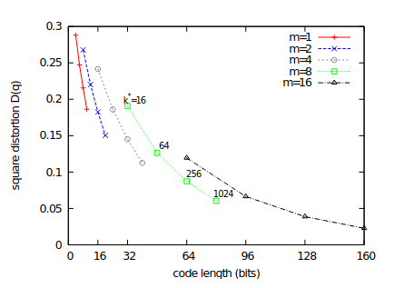
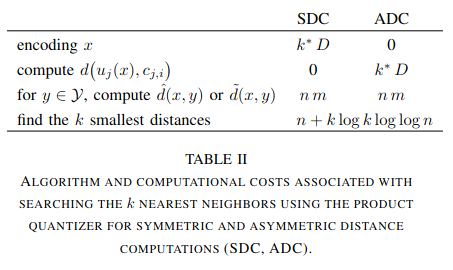
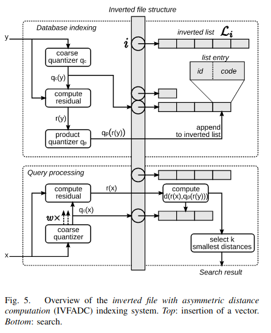
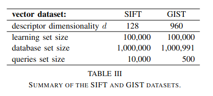
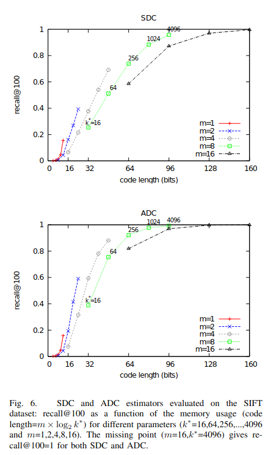
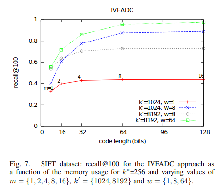
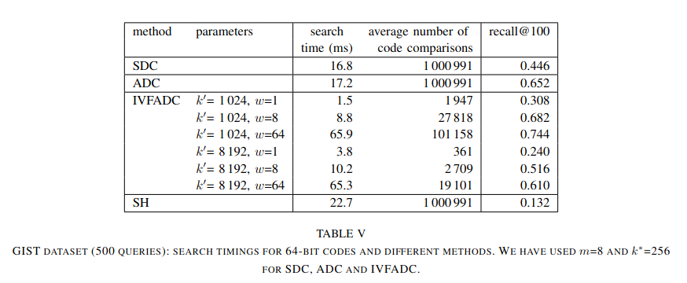

# Product quantization for nearest neighbor search

https://lear.inrialpes.fr/pubs/2011/JDS11/jegou_searching_with_quantization.pdf

**Задача**: есть $n$ векторов $X$ размерности $d$, запрос $q$. Требуется найти ближайший вектор $x$ в смысле $x \cdot q$.

Если решать полным перебором по исходнм векторам, то временная сложность $\mathcal{O}(nd)$. На практике $n$ бывает порядка $10^9$ и $d$ порядка $10^3$, а в таком случае полный перебор очень медленный для практических приложений.   

## Quantization

Проблема памяти может быть хорошо решена, если заменить каждый из $n$ векторов идентификатором.  

Зафиксируем число бит, которое мы готовы аллоцировтать под каждый идентификатор: $l$.  
Пусть $k$ - число ячеек, на которое можно разбить исходное векторное пространство. Чем больше $k$, тем меньше ошибка квантизации $mse(q)$. Максимально возможное $k$ равно $2^l$.

Как разбить векторное пространство на $k$ частей? 

Самый простой - обучить kmeans на $K$ кластеров, и каждому из $n$ хранимых векторов присвоить идентификатор ближайшего кластера. 
Затраты памяти: $\mathcal{O}(Kd)$ - центроиды.  

Но можно сделать иначе: разобьём простостранство размерности $d$ на $m$ подпространств размерности $\frac{d}{m}$, и для каждого такого подпространства обучим свой kmeans на $k$ кластеров. 
$m$ и $k$ - гиперпараметры, подбираемые таким образом, чтобы $m\log_{2}k = l$. Данное преобразование называется *product quantizer* - это функция $q_{p}: \R^d \rightarrow \{0..k-1\}^m$, параметризуемая параметрами $m$ и $k$.  
Затраты памяти: $\mathcal{O}(md)$ - центроиды, для SDC: $\mathcal{O}(mk^2)$ - попарные расстояния между центроидами каждого kmeans-а. Про SDC будет в разделе про инференс.  

Можно заметить, что второй вариант вариант сильно выигрывает у первого по памяти: при $l = 64$ в первом варианте потребуется хранить $2^{64}$ $d$-мерных векторов, а во-втором - $2^8$ $d$-мерных векторов при $k = 2^8$ и $m = 8$. Более того, при такой конфигурации первый вариант вовсе не реализуем.  

**В этом и есть основная идея статьи:** при фиксированном $l$ разбивать простанство размерности $d$ на максимально возможное число ячеек $2^d$ путём кодирования каждой такой ячейки через декартово произведение $m$ кодов подпространств размерности $\frac{d}{m}$, каждый из которых принимает $k$ возможных значений. 

Как подобрать $m$ и $d$? В статье есть такой график:



* $mse(q)$ не монотонно убывает по $l$
* $mse(q)$ не монотонно убывает по $m$
* $mse(q)$ монотонно убывает по $k$  
* при фиксированном $l$ приоритетней наращивать $k$, чем $m$.  

Авторы пишут, что $k = 256$, $m = 8$ "is often the reasonable choice".

## Exhaustive search

Есть два подхода: asymmetric distance computation (ADC) и symmetric distance computation (SDC).  
Пусть $x_{c}$ - идентификатор хранимого вектора $x$, состоящий из $m$ целых чисел из промежутка $[0, k)$, $q_{c}$ - аналогично для вектора запроса $q$.   
Различие в том, как аппроксимировать $x \cdot q$: в SDC через $x_{c} \cdot q_{c}$, а в ADC - $x_{c} \cdot q$. Второй вариант даёт более точный результат, потому что отсутствует ошибка квантизации $q$.  
Ниже представлены псевдокоды данных алгоритмов. В квадратных скобках указаны размерности.

**SDC**:
```python
import numpy as np

# q: [d], float
# centroids: [m, k, d//m], float
# data: [n, m], int
# D: [m, k, k*], float. Кэшированные попарные расстояния центроидов.

Dc = compute_dists(centroids, q)  # [m, k]
qc = Dc.min(1)  # [m]
dists = np.zeros(n)
for i in range(n):
    xc = data[i]
    for j in range(m):
        dists[i] += D[j, xc[j], qc[j]]
```

**ADC**:
```python
import numpy as np

# q: [d], float
# centroids: [m, k, d//m], float
# data: [n, m], int

Dc = compute_dists(centroids, q)  # [m, k]
dists = np.zeros(n)
for i in range(n):
    xc = data[i]
    for j in range(m):
        dists[i] += Dc[j, xc[j]]
```
Временная сложность данных алгоритмов:



Здесь нотация немного другая: запрос - $x$, хранимый вектор - $y$, число кодов каждого из $m$ подпространств - $k^*$, размерность исходных векторов - $D$.  
* временная сложность данных алгоритмов одинаковая: в ADC нужно $\mathcal{O}(md)$ времени для кодирвоания $q$, а в SDC - для расчёта расстояний между $q$ и центроидами. Остальные шаги одинаковы.

## Non exhaustive search

На текущий момент удалось сократить время поиска в $\frac{n}{m}$ раз с $\mathcal{O}(nd)$ до $\mathcal{O}(nm)$. Но перебор всё ещё остаётся полным и не имеет практического смысла при большом $n$.
Сократить пространство поиска можно путём ввода ешё одного kmeans-а на $K$ кластеров над $X$. При инференсе для запроса $q$ находятся $nprobe$ из $K$ ближайших центроид, и полный перебор происходит только среди векторов, относящихся к кластерам, образованных этими центроидами. Таким образом, поиск делается по $n * \frac{nprobe}{K}$ векторам в случае сбалансированных кластеров (на практике кластеры далеко не всегда получаются сбалансированными).   
Данный kmeans называется *coarse quantizer* и обозначается $q_{c}: \R^d \rightarrow \R^d$ - функция, отображающая вектор на одну из $K$ центроид $c_{i}$.  
Ниже представлена схема реализации поиска без полного перебора:



Здесь можно заметить две неупомянутые вещи:
1. **inverted file structure**. Это по сути [инвертированный индекс](https://en.wikipedia.org/wiki/Inverted_index), группирующий векторы по номеру кластера от $q_c$.
2. **compute residuals**. Это $x_{i} - c_{i}$, где $x_i$ - $i$-ый вектор базы, $c_i$ - ближайшая к нему центроида. Как можно видеть на схеме, данная операция выполняется перед обучением $q_{p}$. Это делается для сокращения разброса $X$ с целью снижения ошибки квантизации $q_{p}$. На инференсе центроида также вычитается из $q$.

## Evaluation

Оценка качества проводилась на двух картиночных датасетах: 
1. [local SIFT descriptors](https://en.wikipedia.org/wiki/Scale-invariant_feature_transform): train - Flickr; database, query - INRIA Holiday images.
2. [global GIST descriptors](http://people.csail.mit.edu/torralba/code/spatialenvelope/): train - first 100k from [tiny images](https://citeseerx.ist.psu.edu/viewdoc/download?doi=10.1.1.73.4858&rep=rep1&type=pdf); database - Holidays + Flickr1M; query - Holidays.

Немного статистики о датасетах:



Метрика качества - recall@R (доля запросов, для которых ближайший сосед содержится среди топ-R кандидатов).

Как было сказано выше, ADC предпочтительней использовать из-за отсутствия ошибки квантизации запроса. Ниже показано, как это ошибка сказывается на качестве поиска:



* для достижения одного и того же качества при SDC $l$ должно быть больше, чем при ADC.
* при фиксированном $m$ при SDC $k$ должно быть больше, чем при ADC для достижения сопоставимого качества: в частности, при $m=8$ $k_{sdc} = 256$, а $k_{adc} = 64$.

Качество IVF в зависимости от $K$, $nprobe$ ($k'$ и $w$ в нотации статьи) и $m$:



* сильней всего качество зависит от $nprobe$.
* при фиксированных $m$, $k$, $\frac{nprobe}{K}$ предпочтительней увеличивать ${K}$ и ${nprobe}$: сравнить кривые ((1024, 1), (8192, 8)) и ((1024, 8), (8192, 64)).

Сравнение разных подходов по времени поиска на датасете GIST:



* качество (8192, 64) ниже, чем (1024, 8), хотя (8192, 8) существенно выше, чем (1024, 1). Первое наблюдение расходится с Fig.7, где замеры делались на датасете SIFT
* интересно, что (1024, 8) и (1024, 64) превосходят по качеству ADC. 
* авторы пишут, что при $Kd > \frac{n}{K}$ "the coarse quantizer may be the bottleneck". То есть в случае небольших датасетов предпочтительней использовать полный перебор.