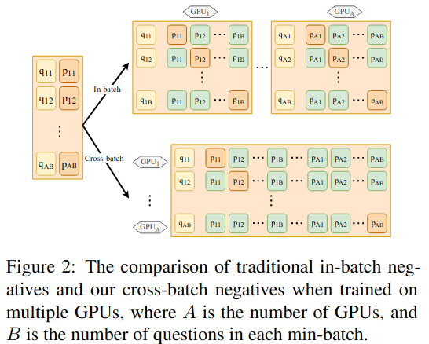
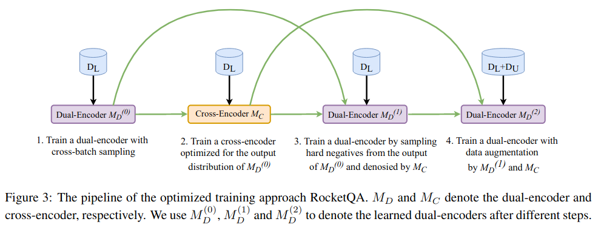
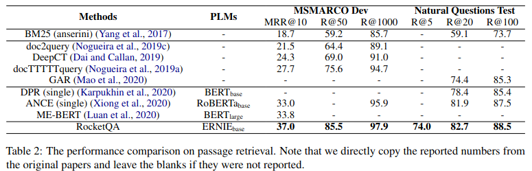
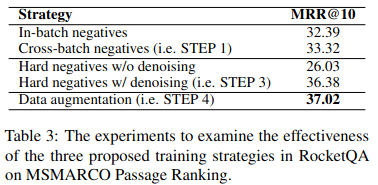
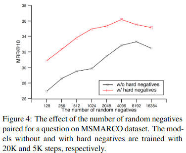
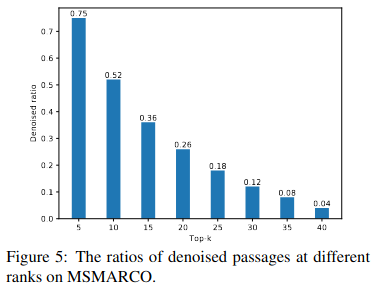
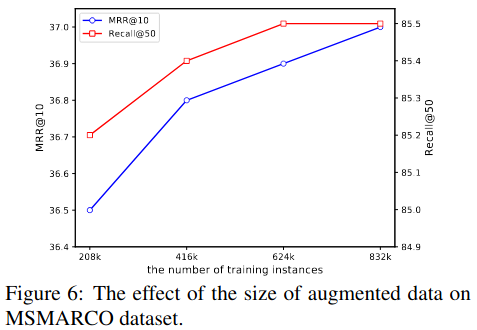
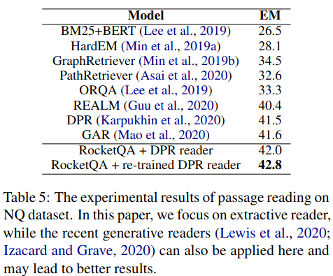

# RocketQA: An Optimized Training Approach to Dense Passage Retrieval for Open-Domain Question Answering

https://arxiv.org/abs/2010.08191

Статья о техниках, позволяющих улучшить DPR [1]:
1. *cross-batch negatives* - в качестве негативных контекстов используются контексты со всех гпу;
2. *denoised hard negatives* - поиска false negatives с помощью реранкера;
3. *data augmentation* - разметка пар (вопрос, контекст) с помощью реранкера.

### **1. Cross-batch negatives**

Данный приём позволяет частично решить проблему несоответстия обучения инференсу: на инференсе нужно выбирать релевантный вопросу контекст из значительно большего числа кандидатов, чем во время обучения.   
Пусть $B$ - число вопросов в батче, $A$ - число гпу. Наиболее эффективным по памяти подходом к получению негативных примеров является *in-batch negatives*: для $i$-ого вопроса в качестве негативных конеткстов выступают позитивные контексты для вопросов $j \ne i$. При таком подходе на каждой гпу каждому из $B$ вопросов будет сопоставлен один положительный контекст и $B - 1$ отрицательных. Затем будет посчитан лосс и усреднён между гпу.  
Но можно более эффективно использовать положительные контексты с $i$-ой гпу: а именно, использовать их в качестве негативных контекстов для вопросов на гпу $j \ne i$. Ниже показана иллюстрация этой идеи:

В таком сетапе каждому вопросу сопоставлено $AB - 1$ негативных контекстов, что позволяет получить более сильный обучающий сигнал: искать релеватный контекст среди $AB$ кандидатов сложней, чем среди $B$.

Если помимо положительного контекста добавить ещё один сложный отрицательный (hard negative), то число кандидатов возрастает вдвое в обоих подходах.

### **2. Denoised hard negatives**

В [1] в качестве hard negatives выступали контексты из топа выдачи BM25, в которых нет строки ответа. У такого подхода есть проблемы:
* данный подход применим только к вопросам, на которые возможно ответить коротко: назвать дату, имя, место, ... (т.е. к фактологическим вопросам). Но если на вопрос подразумевается развернутый ответ (например, на вопрос "почему?"), то с высокой вероятностью случайный релевантный контекст не будет содержать заранее заготовленный ответ из обучающей выборки.
* от себя: отсутствие строки ответа не гарантирует того, что с помощью контекста нельзя ответить на вопрос: например, написание ответа в контексте отличается от написания в обучающей выборке ("3", "три");

Решить обе эти проблемы предлагается с помощью реранкера: в качестве hard negatives брать только те контексты, в "отрицательности" которых реранкер достаточно уверен.

### **3. Data augmentation**

Здесь предлагается взять много неразмеченных пар (вопрос, контекст) и, прогнав из через реранкер, разделить на положительные и отрицательные в зависимости от скора реранкера. При этом использовать только такие пары, в оценке релевантности которых реранкер достаточно уверен: скор большой по модулю. Эти неразмеченные пары можно получить так: взять много вопросов и какой-нибудь ранее обученный ретривер, и с помощью него получить топ-$k$ контекстов для каждого вопроса.

### **Training pipeline**

Нотация:

* $C$ - множество контекстов
* $Q_L$ - вопросы, для которых есть размеченные контексты из $C$
* $Q_U$ - вопросы, для которых нет размеченных контекстов из $C$
* $D_L$ - размеченное подмножество $Q_L \times C$
* $D_U$ - $Q_U \times C$
* $M_D^{(i)}$ - ретривер (D - dual-encoder), полученный на стадии обучения $i$
* $M_C^{(i)}$ - реранкер (C - cross-encoder), полученный на стадии обучения $i$

Стадии обучения:
1. Обучить $M_D^{(0)}$ с использованием $D_L$.
2. Обучить $M_С^{(0)}$. Позитивы - из $D_L$, негативы - сэмпл контекстов из топ-$k$ от $M_D^{(0)}$ над $C$ без позитивов из $D_L$. Идея в том, чтоб реранкер видел именно конетксты из распределения $M_С^{(0)}$. От себя: странно, что для фактоидов не предлагается алгоритмически фильтровать FN.
3. Обучить $M_D^{(1)}$. Позитивы - из $D_L$, негативы - сэмпл контекстов из топ-$k$ от $M_D^{(0)}$ над $C$, в негативности которых достаточно уверен $M_С^{(0)}$.
4. Обучить $M_D^{(2)}$. Позитивы - из $D_L$ и из $D_U$, где $M_С^{(0)}$ уверен в позитивности. Негативы - из $D_U$, где $M_С^{(0)}$ уверен в негативности.

Данные процесс представлен на рисунке ниже:

Собственно, статья названа *RocketQA* по аналогии со [ступенями](https://en.wikipedia.org/wiki/Multistage_rocket) в ракете :)

### **Experiments**

Датасеты: 
* [MSMARCO](https://microsoft.github.io/msmarco/) - каждому вопросу соответствуют топ-$k$ конеткстов, полученных с помощью выдачи бинга. Всего 1M вопросов и 8.8M контекстов.
* [Natural Questions](https://ai.google.com/research/NaturalQuestions) - 300k вопросов из поиска гугла, каждому соответствует статья их википедии со спаном ответа. Для текущих экспериментов были отобраны примерно 62k фактоидов, а поиск делался по английской википедии, нарезанной на 21M конеткстов.

Метрики:
* mean reciprocial rank (MRR)
* recall@k
* exact match (EM)

Другие детали:
* [PaddlePaddle](https://github.com/PaddlePaddle/Paddle)
* 8 V100
* retriever - ERNIE 2.0 base; reranker - ERNIE 2.0 large
* cross-batch negatives
* reranker_score(q, p) < 0.1 $\rightarrow$ негативная пара
* reranker_score(q, p) > 0.9 $\rightarrow$ позитивная пара
* pos:neg = 1:4 на MSMARCO и 1:1 на NQ
* batch size на msmarco: 512 $\times$ 8 - ретривер, 64 \times$ 4 - реранкер. На NQ батч сайз в 4 раза меньше, потому что данных меньше. Для обучения с таким огромным батч сайзом используется [gradient checkpoint](https://arxiv.org/abs/1604.06174). Далее будет показана оправданность такого большого батча
* num epochs: ретривер - (40, 10, 10) на трёх стадиях на MSMARCO, 30 - на NQ. Реранкер - 2
* optimizer: Adam
* learning rate: ретривер - 3e-5, реранкер - 1e-5. linear warmup 0.1
* max length: вопрос - 32, контекст - 128
* источники вопросов для сбора неразмеченных пар (вопрос, ответ): [Yahoo! Answers](http://answers.yahoo.com/), [ORCAS](https://dl.acm.org/doi/10.1145/3340531.3412779), [MRQA](https://arxiv.org/abs/1910.09753). 

Итоговые результаты ретривера:

* RocketQA лучше всех;
* все DPR лучше всех BM25 (всё, кроме последних четырёх строк).

Ablation каждой из предлагаемых стадий:

* очень сильно докидывает денойзинг реранкером

Качество в зависимости от числа рандомных негативов, определяемое размером батча и числом гпу:

* видно, что использование огромных батчей действительно опрвдано;
* можно заметить, что при достаточно большом батче можно без сложных негативов достичь более высокого качества, чем со сложными негативами при меньшем батче;
* в какой-то момент качество начало снижаться. В статье приводится гипотеза, что это может быть связано с тем, что размер батча слишком велик для числа обучающих примеров;
* от себя: в своих экспериментах замечал, что большой батч обеспечивает более быструю сходимость за счёт более сильного обучающего сигнала, хотя если учить до выхода лосса на плато, то разница в качестве становится небольшой. В данном случае большая разница может наблюдаться по той причине, что использовалось одно и то же число шагов при каждом сетапе, причём достаточно небольшое для выхода лосса на плато.

Оценка количества FN в топе:

* чем выше ранг, тем выше доля таких контекстов, которые реранкер посчитал позитивами (очевидно);
* можно заметить, что на MSMARCO эта доля достаточно большая, чем и объясняется скорее всего такой сильный прирост в качества с включением денойзинга (таблица 3).

Влияние числа аугментаций на качество:

* чем больше аугментаций, тем лучше (очевидно), но не существенно в сравнении с денойзингом.

Ниже представлена табоица с влиянием доработок на end-to-end качество (retriever + reader). Качество замерялось как с ридером из [1] (чтоб оценить только влияние контекстов от нового ретривера), так и с переученным ридером.

* новый ретривер позволяет улучшить end-to-end качество в обоих сетапах.

### **Conclusion**

Предложенные доработки позволяют существенно повысить качество поиска (особенно отбор сложных негативов с помощью реранкера).

### **References**

[1] Karpukhin et al. [Dense passage retrieval for open-domain question answering](https://arxiv.org/abs/2004.04906), 2020